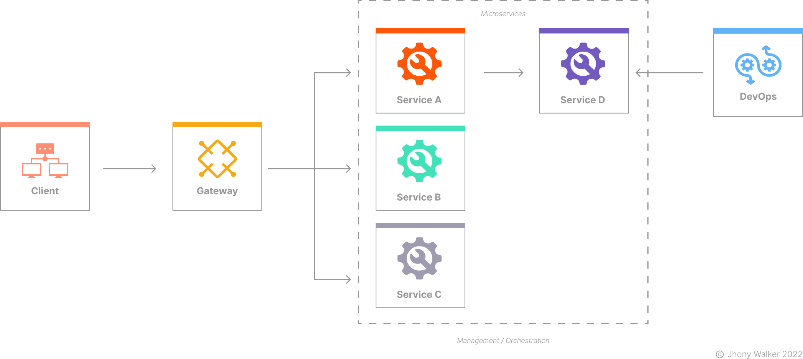

This project is a monorepo containing a REST API gateway with [gRPC](https://grpc.io/) backend microservices all written using the NestJS Framework and TypeScript. This project is mainly used for learning/trial purposes only.

## Architecture

<h1 align="center">
    
</h1>

## Design Patterns

This architecture implements the following Microservice Design Patterns:

- **Microservice Architecture**
- **Subdomain Decomposition**
- **Externalized Configuration**
- **Remote Procedure Invocation**
- **API Gateway**
- **Database per Service**

## Contributions

- [ ] Fork this repository;
- [ ] Create a branch with your feature: `git checkout -b my-feature`;
- [ ] Commit your changes: `git commit -m 'feat: my new feature'`;
- [ ] Push to your branch: `git push origin my-feature`.

## License

The MIT license, also called the X license or the X11 license, is a computer program license created by the Massachusetts Institute of Technology. It is a permissive license used in both free software and proprietary software.
